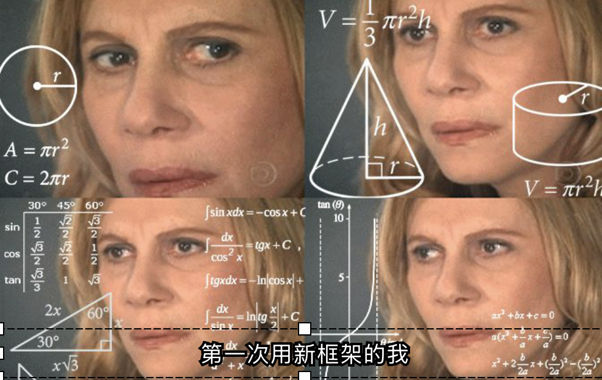
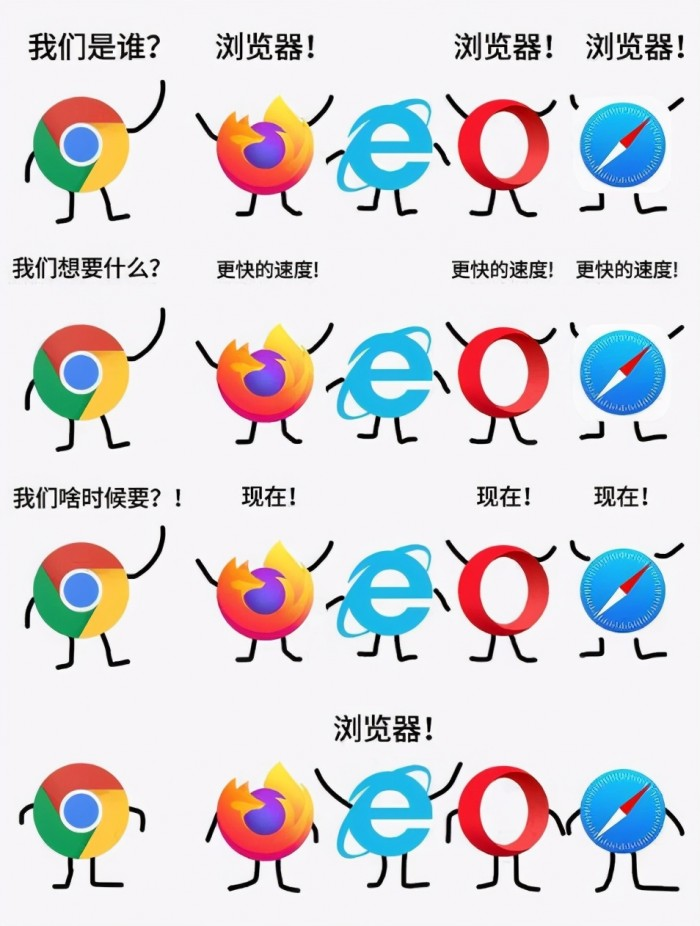
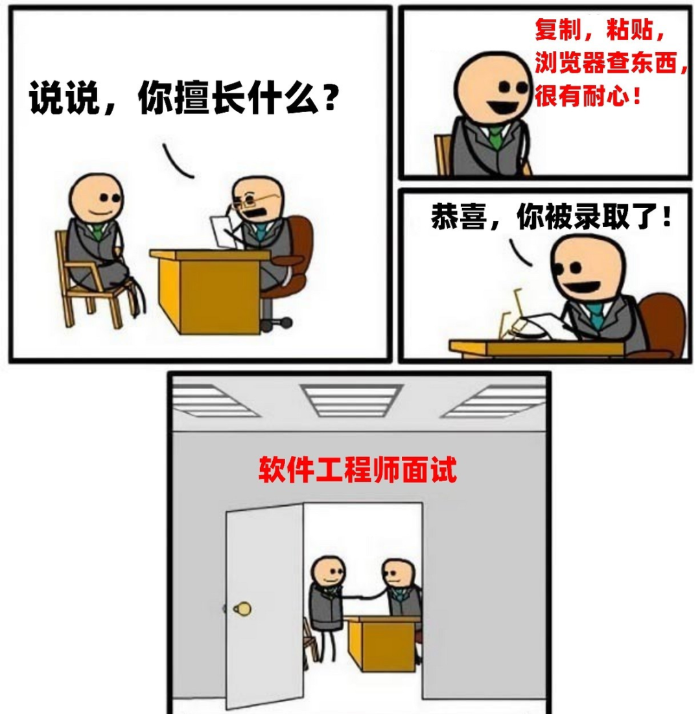

# 2.1 心态开放，你的职场第一课

## 为什么心态开放这么重要？

还记得第一次接触新框架时的感觉吗？面对满屏的新概念，你可能像我一样，恨不得立刻关掉编辑器，躲回自己熟悉的"舒适窝"。这就像一只从来没见过大海的青蛙，突然被扔进了太平洋 —— 慌得不行。

但你知道吗？正是这种"慌得不行"的感觉，往往预示着我们遇到了成长的机会。

### 固定型思维 vs 成长型思维

说到思维模式，不得不提心理学家德韦克提出的这两种类型：

**固定型思维的小伙伴们是这样的：**
- "这个新框架太难了，我学不会的"
- "我就是个后端程序员，前端的事情碰都不想碰"
- "我写了十年Java，改不了这个习惯了"
- "新技术？等别人踩完坑再说吧"

听起来是不是特别耳熟？这就像一只固执的鸵鸟，遇到挑战就把头埋在沙子里，心想："看不见就不存在"。

**而成长型思维的小伙伴则是这样的：**
- "虽然看不懂，但是好像挺有意思的"
- "多学一样技能，多一条路"
- "试试看呗，大不了就是报错"
- "踩坑也是一种经验啊"

这就像一只好奇的猫咪，看到什么新东西都想去拨弄两下，说不定就发现了新大陆。

### 为什么说心态开放是第一课？

想象一下，如果你是一个杯子：
- 固定型思维就像一个已经装满水的杯子，新的东西都装不进去
- 成长型思维则像一个空杯子，随时准备接纳新的知识

在职场中，技术更新得比你手机系统还快。今天你精通的技术，明天可能就变成"传统艺能"了。如果不保持开放的心态：
- 新技术学不进
- 新方法用不上
- 新机会抓不住
- 新发展看不到

就像那句老话："`SELECT * FROM world WHERE 心态 = '开放'`"——好吧，这是我编的，但你懂我意思。

## 如何培养开放的心态？

### 1. 拥抱"不懂"

记得我刚转行做程序员时，遇到不懂的东西特别害怕被人发现，问问题之前要先憋上半天，搜索一堆资料，生怕被人说"连这都不知道"。

现在想想，这就像公共场合突然想放屁一样，憋得自己难受，还要装作若无其事一样不让人看出来。其实，承认"不懂"一点都不丢人，丢人的是：不懂装懂（这是最容易被戳穿的），不懂不学（这是最快掉队的），不懂不问（这是最耽误事的）。

### 2. 学会"归零"

每隔一段时间，我们都需要给自己"格式化"一下：
- 清空已有的经验偏见
- 重新审视工作方式
- 思考是否有更好的解决方案

就像我们的电脑一样，时不时需要重启一下，清清缓存，更新更新系统。不然，你可能还在用IE浏览器，坚持认为这是最好的选择。

### 3. 保持好奇心

好奇心就像是我们的"技能点"，需要不断投入：
- 看到新技术，先想想"这个有意思"
- 遇到新方法，试着问问"为什么"
- 碰到新工具，琢磨着"怎么用"

记得有个同事说过："我不是天才，但我有一颗八卦的心。"没错，职场进步有时候就靠这种"八卦"精神。

### 4. 建立"试错"机制

很多人不敢尝试新东西，是因为害怕犯错。但是，你想啊：
- 测试环境不就是用来犯错的吗？
- Code Review不就是用来发现问题的吗？
- 版本控制不就是用来后悔的吗？

把"试错"当作学习的一部分，就像打游戏一样，死几次才能熟悉地图，这很正常。

## 开放心态的实践建议

### 1. 从小事开始
不要一上来就要啃最难的骨头，可以：
- 今天试用一个新的IDE插件
- 明天学习一个新的快捷键
- 后天尝试一个新的调试方法

就像玩游戏要从新手村开始一样，一步步来。

### 2. 找到学习伙伴
- 和同事组成学习小组
- 参加技术社区
- 关注技术大牛的博客

有个伙伴一起学习，就不会觉得自己是一个人在战斗，同时，小伙伴还会给你带来新的视角和思路，甚至于，起到一定的监督作用。

### 3. 建立反馈循环
- 定期总结学习收获
- 及时记录遇到的问题
- 分享自己的心得体会

就像写代码要有单元测试一样，学习也需要及时的反馈。这个是非常重要的，因为只有反馈，才能让我们知道自己的学习效果，才能让我们知道自己的学习方向是否正确，也更能让我们有动力去继续学习。

## 结语

心态开放不是让你变成一个没有主见的"随风草"，而是要成为一个愿意尝试的探索者，乐于学习的追求者，勇于改变的行动者。

就像一个优秀的程序，既要有稳定的核心逻辑，也要有足够的扩展性。保持开放的心态，就是给自己的"程序"预留了足够的接口，随时准备迎接新的更新和升级。

毕竟，在这个快速发展的互联网时代，唯一不变的就是变化本身。与其抗拒，不如拥抱。让我们带着开放的心态，开始职场的新征程吧！
