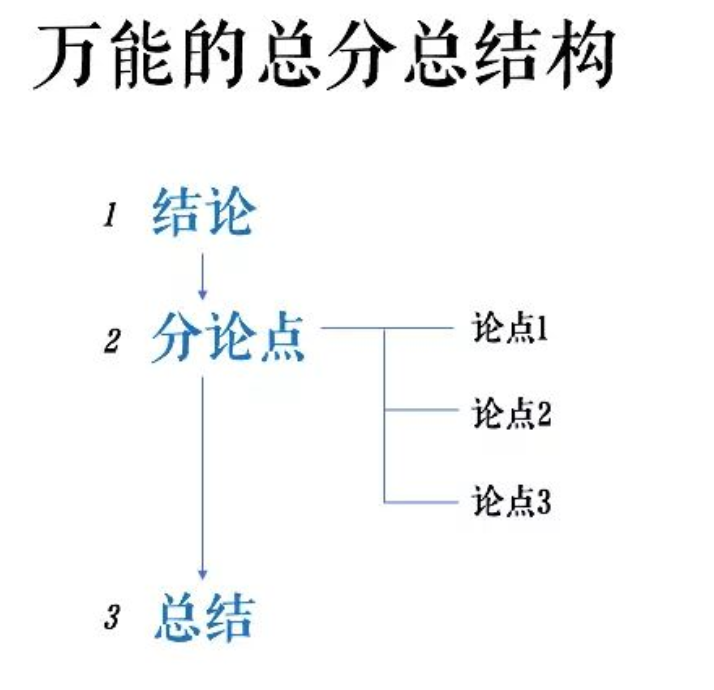
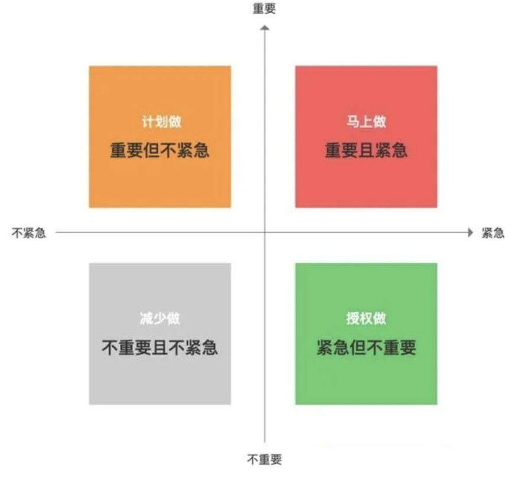
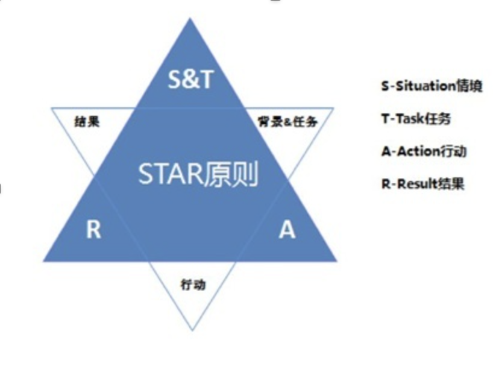

# 2.11 职场中最实用的三个思维模型

"这个需求怎么说清楚？"
"这堆任务怎么排优先级？"
"述职报告怎么写？"

每次遇到这些问题，是不是感觉脑子有点乱？
今天我们就聊三个特别实用的思维模型。

不是那种看完就忘的"高大上"框架，
而是真的能用、常常用、越用越顺手的工具。

## 一、总分总模型：让表达更清晰

### 什么是总分总？
简单说就是：先说结论（总），再说细节（分），最后重申（总）。

就像写周报：
"本周完成了订单系统优化（总）
具体包括修复了三个性能问题，优化了两个接口，新增了监控（分）
整体性能提升了30%（总）"

### 实战场景

#### 1. 写周报
差的版本：
"这周修了三个bug，开发了两个功能，参加了四个会议..."
（领导看完：所以重点是什么？）

好的版本：
"这周主要完成了订单系统的性能优化（总）
- 修复了三个性能瓶颈
- 优化了两个核心接口
- 系统响应提升了30%
整体达到了预期的优化目标（总）"

#### 2. 技术方案汇报
差的版本：
"我们要用这个技术，那个框架，还要用什么什么..."
（听众：所以你要做什么？）

好的版本：
"这个方案主要解决订单峰值问题（总）
- 优化系统架构
- 增加缓存机制
- 改进数据处理
通过这些措施，系统可以支撑双十一峰值（总）"

## 二、优先级四象限：让工作更高效

### 什么是优先级四象限？
把任务按照"重要"和"紧急"分成四类：

- 重要且紧急（第一象限）
- 重要不紧急（第二象限）
- 紧急不重要（第三象限）
- 不紧急不重要（第四象限）

### 实战场景

#### 1. 处理各种任务

重要且紧急：

- 线上故障
- 重大bug
- 老板要的报告

重要不紧急：

- 系统重构
- 技术升级
- 团队建设

紧急不重要：

- 各种会议
- 日常报表
- 临时帮忙

不紧急不重要：

- 茶水间八卦
- 日常闲聊
- 整理工位

#### 2. 排期安排
早上来到公司：

- 产品经理说有个紧急需求
- 测试说发现个严重bug
- 运维说要升级系统
- 同事说要帮看个问题

按四象限排序：
1. 先处理严重bug（重要且紧急）
2. 再看紧急需求（评估重要性）
3. 安排系统升级（重要不紧急）
4. 最后帮看问题（不紧急不重要）

## 三、STAR模型：让经历更有说服力

### 什么是STAR？
- Situation（情境）：什么背景
- Task（任务）：做什么事
- Action（行动）：怎么做的
- Result（结果）：达到什么效果

### 实战场景

#### 1. 写述职报告
差的版本：
"我负责了订单系统的开发维护，完成了性能优化..."

好的版本：
"Situation：订单系统在双十一期间频繁超时
Task：需要优化系统性能，确保双十一稳定性
Action：

- 梳理系统瓶颈
- 优化数据库查询
- 引入缓存机制
- 添加监控告警
Result：

- 系统响应时间降低70%
- 双十一零故障
- 经验在团队内推广"

#### 2. 面试介绍项目
差的版本：
"我做过订单系统，用了各种技术框架..."

好的版本：
"S：公司准备双十一大促
T：负责订单系统的性能优化
A：通过以下步骤：

- 性能压测定位问题
- 优化系统架构
- 增加缓存机制
- 改进数据处理
R：系统最终支撑了双十一百万订单"

## 这三个模型的配合使用

### 1. 写文档时
- 用总分总组织整体结构
- 用四象限突出重点内容
- 用STAR描述关键实践

### 2. 解决问题时
- 用总分总梳理思路
- 用四象限确定优先级
- 用STAR总结复盘

### 3. 汇报工作时
- 用总分总组织语言
- 用四象限展示重点
- 用STAR讲述成果

## 最后的建议

### 1. 少即是多
- 与其记100个用不上的模型
- 不如精通3个天天都用的工具

### 2. 多实践
- 不要只是记住
- 要在日常工作中刻意练习
- 直到形成肌肉记忆

### 3. 灵活运用
- 模型是工具不是教条
- 根据场景灵活调整
- 找到最适合自己的方式

记住：
思维模型就像我们常用的工具，
不是放在工具箱里就有用，
而是要经常拿出来用，
用着用着就顺手了。

（这篇文章就是用总分总写的，你发现了吗？） 