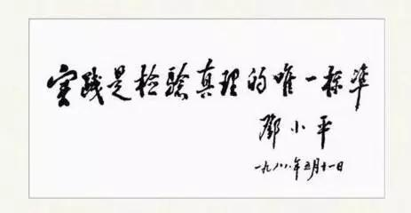

# 2.2 下场去做，你的职场第二课

## 从一个真实的故事开始

记得我刚开始学React的时候，整整看了两周的教程和文档。脑子里天天想着组件生命周期、虚拟DOM、状态管理...但是迟迟不敢动手写第一行代码。

直到有一天，leader把一个小需求甩给我：
"这个页面很简单，你用React重构一下。"

我："啊？可是我还没完全理解React的设计理念..."
leader："先做，边做边学。"

就这样，我被迫上手了。结果发现很多觉得复杂的概念，用起来其实很简单，很多觉得简单的东西，做起来还真有点绕，书上看懂的东西，实操时经常卡壳，但是！真的做了之后，很多疑惑都自然解开了。

## 为什么我们总是迟迟不动手？

### 1. 完美主义的陷阱
- "再多看几个教程..."
- "等我把设计模式全部搞懂..."
- "让我再研究下最佳实践..."
- "这个方案还不够完美..."

### 2. 对失败的恐惧
- "万一写得不好被同事笑话..."
- "要是项目做砸了怎么办..."
- "这个技术栈我不熟悉，不敢碰..."
- "万一出了线上问题..."

### 3. 舒适区的诱惑
- "现有的方案虽然不完美，但是能用..."
- "学新技术太累了，还是用老技术吧..."
- "这个功能用jQuery也能实现..."
- "重构风险太大，能跑就行..."

## 不动手的后果是什么？

### 1. 技术停滞
- 知识始终停留在理论层面
- 实战经验得不到积累
- 问题解决能力无法提升
- 技术广度和深度都受限

### 2. 焦虑加剧
- 看着别人进步，自己原地踏步
- 害怕承担责任，导致机会越来越少
- 对新技术的恐惧越来越深
- 职业发展陷入瓶颈

### 3. 能力退化
- 执行力逐渐下降
- 解决问题的勇气越来越小
- 面对挑战时习惯性退缩
- 创新能力逐渐丧失

## 为什么要"下场去做"？

### 1. 实践是最好的学习
- 动手实操比看十篇教程有用
- 真实项目中的一个bug能学到很多东西
- 生产环境的问题才是最好的老师
- 实战中的教训记得最深

### 2. 反馈是最好的老师
- 代码写得对不对，跑一下就知道
- 方案可不可行，实践了才清楚
- 性能好不好，上线了就明白
- 用户喜不喜欢，发布了才知道

### 3. 失败是最好的经验
- 每个bug都是成长的机会
- 每次报错都是学习的契机
- 每个坑都值得记录和总结
- 每次失败都是宝贵的经验

## 如何开始行动？

### 1. 从小需求开始
- 先重构一个小组件
- 先优化一个小功能
- 先解决一个小bug
- 先改进一个小细节

### 2. 给自己设定期限
- 本周必须提交一个PR
- 这个月必须上线一个功能
- 这季度必须掌握一个新技术
- 今年必须完成一个完整项目

### 3. 建立反馈机制
- 及时code review
- 定期复盘总结
- 主动收集反馈
- 持续改进优化

## 一些实用建议

### 1. 关于学习新技术
- 先跑通官方demo
- 再写个小项目
- 然后在非核心项目中试水
- 最后才在重要项目中使用

### 2. 关于重构老代码
- 先写测试用例
- 再小范围重构
- 然后逐步扩大范围
- 最后整体优化

### 3. 关于解决问题
- 先本地复现
- 再分析原因
- 然后验证方案
- 最后总结经验

## 结语

程序员的成长没有捷径：理论再扎实，不实践也是空的；方案再完美，不执行也是零；想法再好，不落地也是假的。

就像写代码一样，再多的设计模式，不如一个能用的功能；再多的架构图，不如一个能跑的程序；再多的技术预演，不如一次真实的上线。

所以，与其在原地焦虑，不如：

- 放下完美主义的包袱
- 克服对失败的恐惧
- 走出舒适区的束缚
- 勇敢地下场去做

毕竟，代码是写出来的，不是想出来的。
