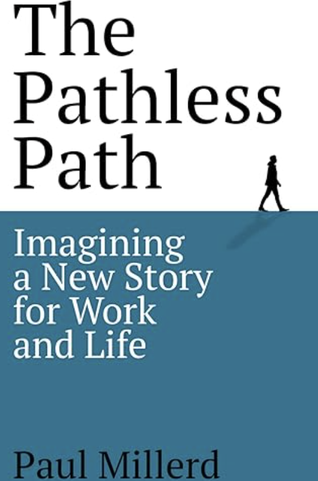

# 5.2 Gap 无罪：寻找属于你自己的 Pathless Path

> 笔者按部就班的工作了8年，终于，在35岁前夕被裁的那一天，我问自己：“这真的是我想要的生活吗？"

关于作者的更多感触，可以看我之前发的视频：[《35岁，我被裁了》](https://www.bilibili.com/video/BV1tg69YTEvm/?spm_id_from=333.337.search-card.all.click&vd_source=f45ec78216863e8a227317224db68392)

## 为什么我们需要 Gap？

说实话，在中国谈 gap，总会被贴上"不求上进"的标签。但其实，gap 不是放弃，而是为了更好地前进。就像代码里需要断点调试一样，人生偶尔也需要暂停下来，看看自己到底在哪里。

工作久了，很多人会发现一个有趣的现象：明明工资在涨，技能在增长，但内心的倦怠感却越来越强。这不是你的问题，而是工作异化的结果。我们把自己变成了一台高效的编码机器，忘记了自己还是个需要思考和成长的人。

## Default Path vs Pathless Path

### 默认路径（Default Path）
这是我们最熟悉的路：
- 好好学习
- 找份稳定工作
- 努力晋升
- 买房结婚
- 养老退休

这条路没有错，但问题是：这真的是你想要的吗？还是仅仅因为"大家都这样"？

### 无径之径（Pathless Path）
这是一条需要自己探索的路。没有现成的地图，没有标准答案，但可能更适合你。

我有个朋友，工作第六年时决定 gap 了三个月。他说：**"刚开始特别慌，感觉自己浪费时间。但慢慢地，我开始思考什么是真正重要的。"**

后来他没有回到原来的大厂，而是选择了一家小公司，工资低了不少，但他能主导产品方向。**"虽然收入少了，但我终于找回了写代码的乐趣。"**

## 为什么要 Gap？

### 1. 找回自我
当我们停下来，才能听到内心真实的声音。很多时候，我们忙得连自己想要什么都忘了。

### 2. 跳出思维定式
就像重构代码一样，有时候需要完全推翻重来，才能写出更好的实现。人生也是如此。

### 3. 充电升级
这不是在浪费时间，而是在给自己一次版本升级的机会。（程序员永远喜欢用版本号类比人生）

## 如何优雅地 Gap？

1. **做好准备金储备**
至少要有6个月的生活费。毕竟重启人生不是请假，需要足够的缓冲时间。

2. **设定探索方向**
gap 不是无所事事，而是有目的的探索。可以：
- 学习新技能
- 环球旅行
- 尝试创业
- 写写技术博客
- 研究自己真正感兴趣的领域

3. **保持开放心态**
也许最后你会回到原来的轨道，也许会找到全新的方向，这都是正常的。重要的是这段探索的过程。

## 关于焦虑

说实话，gap 期间最大的敌人是焦虑。看着前同事们继续在职场上升，而自己似乎在"浪费时间"，这种感觉不好受。

但要记住：**人生不是竞赛，是探索。**

就像一个资深程序员说的（其实就是臭不要脸的我）：**"与其在一条注定会后悔的路上一直走下去，不如勇敢地按下暂停键，去寻找真正属于自己的路。"**

## 写在最后

Gap 不是逃避，而是为了更好地前进。
就像代码重构一样，看似是在推倒重来，实际是在为更好的架构打基础。

记住，选择 gap 的人不是失败者，而是有勇气探索自己人生的勇者。